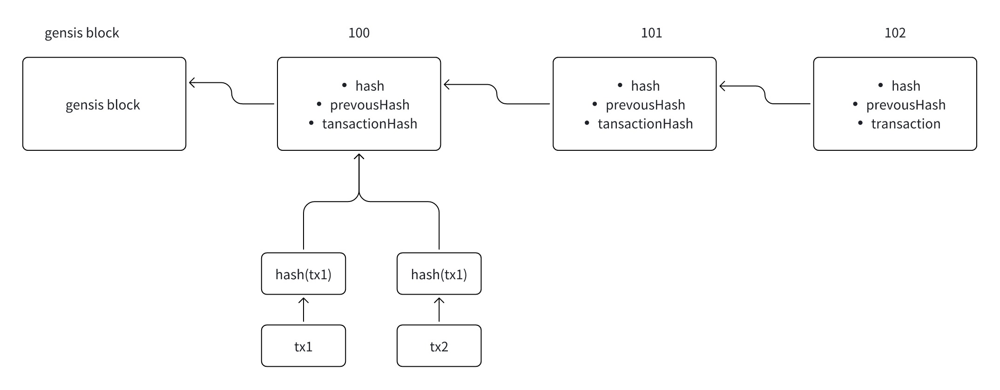

# 第二讲：什么是区块链，区块链的构成元素

## 一.什么区块链(以 Solana 为例子)

### 1. 区块链组织形式

区块链（Blockchain）是一种分布式账本技术，本质上是以加密技术链接的区块组成的链状数据结构。每个区块都包含一系列经过加密处理的数据（通常是交易），通过特定的共识机制来确保链上数据的安全性和不可篡改性。

区块链的组织形式一般分为两个核心部分：

### 1.1. 区块头（Block Header）
区块头通常包含以下信息：

- Slot（插槽）：每个区块在链上都有一个唯一的插槽编号，标记区块产生的位置。
- Parent Slot（父插槽）：表示上一个区块的位置，形成链式结构。
- Hash（区块哈希）：当前区块的唯一标识，通过哈希算法得出。
- Previous Hash（前一个区块的哈希）：确保区块之间的紧密连接。
- Transaction Hash（交易列表的哈希）：对区块中所有交易的摘要，确保数据的完整性。

### 1.2.区块体（Block Body）
- 区块体包括：交易列表（TxList）：包含当前区块的所有交易信息。

## 二.区块链的核心特性

### 1.去中心化（Decentralization）
区块链的网络不依赖于中心服务器，而是由分散在全球各地的众多节点共同维护。节点共同参与交易的验证和出块决策过程，通过共识算法（如 Solana 的 PoH + PoS）确保没有单一实体控制网络。

### 2.不可篡改性（Immutability）
区块链上每一个区块的哈希值均依赖于前一区块，一旦某一区块的数据发生变化，将导致其后的所有区块哈希值发生变更。这种链式哈希结构与共识算法相结合，有效保证了数据记录的不可篡改性。

### 3.可追溯性（Traceability）
区块链的链式结构明确记录每一次数据状态的变化历史，因此每笔交易都能被清晰追踪与审计。这种特性不仅对金融系统至关重要，在供应链、版权保护等领域同样有广泛应用。

### 4.数字资产可追踪性
区块链网络天然支持数字资产的透明记录与流动追踪。这为监管、反洗钱（AML）和交易合规性提供了强大

## 三.以 Solana 为例：区块链网络构成元素详解

Solana 是新一代高性能区块链网络，因其极高的吞吐量（TPS）和低延迟而闻名，特别适用于高频金融交易和实时应用。Solana 网络结构包括以下核心元素：

### 1.节点（Validators）
Solana 网络中的验证节点负责接收交易请求，验证交易，打包交易到区块并参与共识过程。任何符合硬件条件的个体或组织都可运行节点参与共识过程，维持网络的去中心化与安全性。

### 2.共识机制（Proof of History + Proof of Stake）

Solana 采用独特的混合共识机制：

- 历史证明（Proof of History, PoH）：由一个可验证的时间序列对事件顺序进行标记，大幅提高交易处理速度。
- 权益证明（Proof of Stake, PoS）：验证者质押代币以保障网络安全，权益越高的节点出块权重越大，激励节点保持诚信行为。

### 3. 区块结构（Block Structure）
Solana 网络的区块结构严格而高效：

- Block Header 包括：
  - Slot（当前区块插槽）
  - Parent Slot（前一区块插槽）
  - Block Hash（区块哈希）
  - Previous Hash（前一区块哈希）
  - Transactions Hash（区块交易哈希）

- Block Body：
- 包含大量的交易数据 (TxList)，由于 Solana 的优化，单个区块可支持成千上万的交易。

### 4.账户与状态管理（Account State）
Solana 网络将数据以账户（Account）的形式进行存储，类似于文件系统的方式组织数据：

- System Account：存储基础的账户余额信息。
- Program Account：存储智能合约逻辑的程序代码。
- Data Account：用于储存特定程序运行所需的数据。

账户系统的高效管理，使 Solana 可以快速且低成本地执行状态变更。

### 5.智能合约与 Solana 虚拟机（SVM）
Solana 使用 Rust 编写智能合约，通过 Solana 虚拟机（SVM）执行程序：

- 智能合约在链上运行实现去中心化应用（DApp）的逻辑。
- SVM 高效的并行执行能力使网络可同时处理多个智能合约调用。

### 6. 网络通信协议（Gossip Protocol）
Solana 使用 Gossip 协议实现节点间信息快速传播：

- 节点自动发现网络中的其他节点。
- 节点间高效交换交易和区块信息。

这一机制确保网络状态的快速同步与共识的高效达成。

## 四.总结与展望

区块链是一种颠覆性的底层技术，它的核心价值在于去中心化、安全、透明、不可篡改与高效可追溯性。而以 Solana 为代表的现代区块链，更在性能和扩展性方面实现巨大突破，正迅速推动区块链技术迈向大规模商业应用。

理解区块链网络的结构和特性，不仅有助于开发者构建更好的应用，也有助于公众更清晰地看待区块链如何重塑世界。区块链的未来，值得每个人期待。

